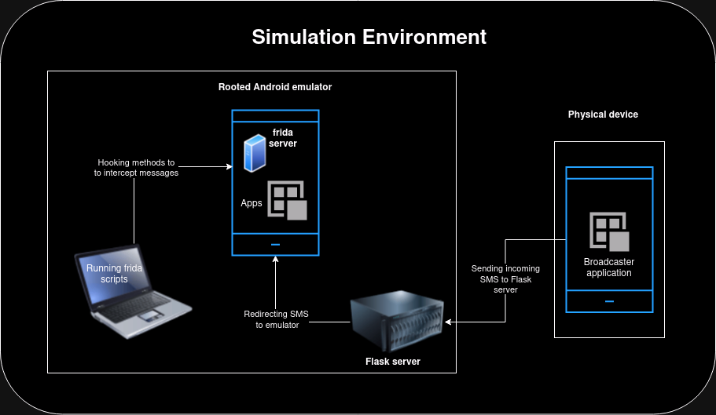

# **Automatic SMS Reader Vulnerability Framework**  

## **Overview**  
This project investigates the security and privacy risks of mobile applications that automatically read SMS messages, focusing on OTP interception. The framework simulates real-world vulnerabilities using a broadcaster app, Flask server, and rooted Android emulator with Frida-server to analyze and test application behaviors. 



## **Features**  
- **Broadcaster Application:** Captures incoming SMS and forwards it to a designated server.  
- **Flask Server:** Forwards intercepted SMS to a rooted Android emulator via Telnet.  
- **Rooted Emulator:** Uses Frida-server for API hooking and monitoring application behaviors.  
- **Frida Integration:** Allows real-time interception and analysis of APIs and activities handling SMS.  

## **Setup**  

### **Prerequisites**  
- Android Studio (with AVD Manager)  
- Python 3.x  
- Flutter SDK  
- Frida Tools (`frida`, `frida-server`)  
- Flask (`pip install flask`)  

---

### **Broadcaster App Setup**  
1. Clone the repository and navigate to the broadcaster app folder.  
2. Run the app using the Flutter CLI:  
   ```bash
   flutter run
   ```  
3. Configure the server IP and port within the app interface.  

---

### **Flask Server Setup**  
1. Install Flask:  
   ```bash
   pip install flask
   ```  
2. Run the server:  
   ```bash
   python flask_server.py
   ```  
3. Ensure the server runs on port 5000 or the port specified in the broadcaster app.  

---

### **Rooted Emulator Setup**  
1. Clone and install the `rootAVD` tool:  
   ```bash
   git clone https://github.com/newbit1/rootAVD.git  
   cd rootAVD  
   ./rootAVD.sh  
   ```  
2. Root the emulator using:  
   ```bash
   ./rootAVD.sh system-images/android-<api-level>/google_apis_playstore/<arch>/ramdisk.img  
   ```  

---

### **Frida-Server Setup**  
1. Push `frida-server` to the emulator:  
   ```bash
   adb push frida-server /data/local/tmp  
   adb shell "su -c chmod 755 /data/local/tmp/frida-server"  
   ```  
2. Start Frida-server:  
   ```bash
   adb shell 'su -c "/data/local/tmp/frida-server" &'  
   ```  

---

## **How to Use**  
1. **Run Broadcaster App:** Start the app on a device or emulator and input server details.  
2. **Start Flask Server:** Ensure the Flask server is running and ready to receive requests.  
3. **Hook APIs Using Frida:** Use Frida scripts to intercept API calls related to SMS reading.  
   Example command:  
   ```bash
   frida -U -f <package-name> -l activity_monitor.js  
   ```  
4. **Analyze Results:** Monitor logs to observe which APIs and activities handle SMS data.  

---

## **Key Results**  
- Identified specific APIs and broadcasters responsible for SMS interception in applications.  
- Highlighted vulnerabilities in handling SMS unrelated to OTPs.  
- Proposed stricter security measures to mitigate misuse of automatic SMS reading.  

---

## **Future Work**  
- Expand testing to more applications and services.  
- Automate Frida script execution for SMS interception analysis.  
- Collaborate with developers to improve SMS security practices.  

---

## **Contributors**  
- **Jarpula Bhanu Prasad**  
  - Email: [ai21btech11015@iith.ac.in](mailto:ai21btech11015@iith.ac.in)  
  - Under the guidance of: **Dr. Saurabh Kumar**  

---

## **Acknowledgments**  
Special thanks to my advisor and the community for providing tools and resources to make this project successful.   